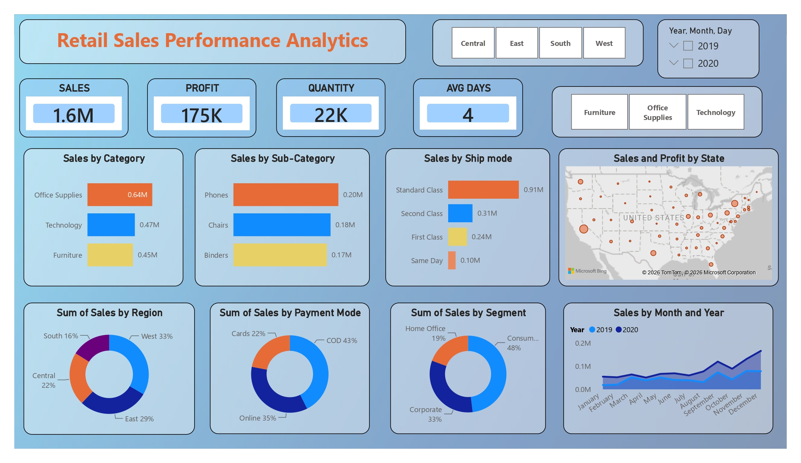
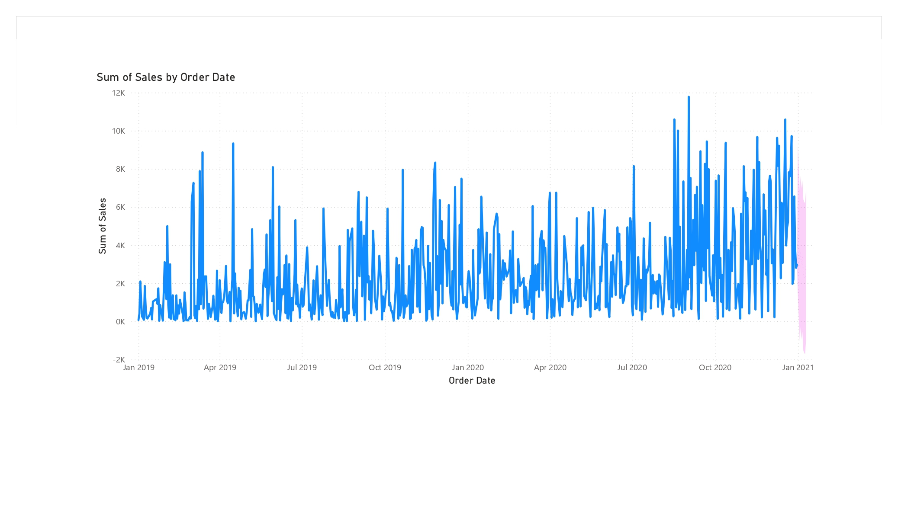

# 📊 Retail Sales Performance Analytics

## 📌 Project Overview

Developed an interactive Power BI dashboard to analyze retail sales performance, profitability, customer segments, and operational efficiency. The dashboard transforms raw sales data into meaningful business insights through interactive visualizations and KPI reporting.

---

## 🎯 Business Objective

This dashboard enables decision-makers to:

- Monitor overall sales performance
- Track profitability across categories
- Analyze customer segments
- Evaluate shipping performance
- Identify top-performing products and regions
- Support data-driven business decisions

---

## 🛠 Tools & Technologies

- Power BI
- Power Query
- DAX
- Microsoft Excel

---

## 📊 Key KPIs

- Total Sales (1.6M)
- Total Profit (175K)
- Quantity Sold (22K)
- Average Shipping Days (4)

---

## 📈 Dashboard Features

- Sales by Category
- Sales by Sub-Category
- Sales by Region
- Sales by Payment Mode
- Sales by Segment
- Sales by Ship Mode
- Monthly Sales Trend
- Interactive Filters
- Geographic Sales Analysis

---

## 💡 Key Business Insights

- Office Supplies generated the highest sales.
- Phones were the top-performing sub-category.
- Standard Class was the most preferred shipping mode.
- West region contributed the highest sales.
- Consumer segment generated the largest share of sales.

---

## 🚀 Skills Demonstrated

- Business Intelligence
- Data Visualization
- KPI Reporting
- Data Modeling
- Power Query
- DAX
- Customer Analytics
- Sales Analytics
- Interactive Dashboard Design
  
# 📷 Dashboard Preview

## Executive Dashboard

---

## Sales Trend Analysis

